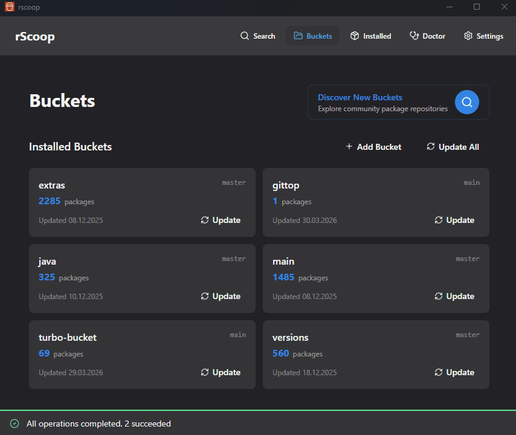
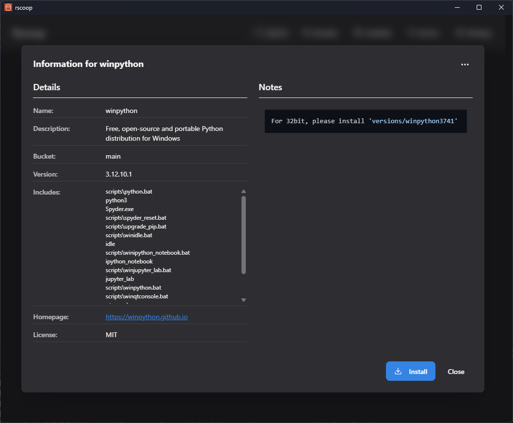
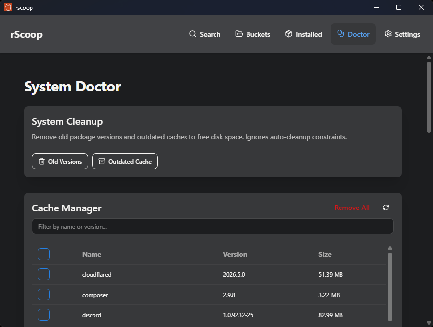
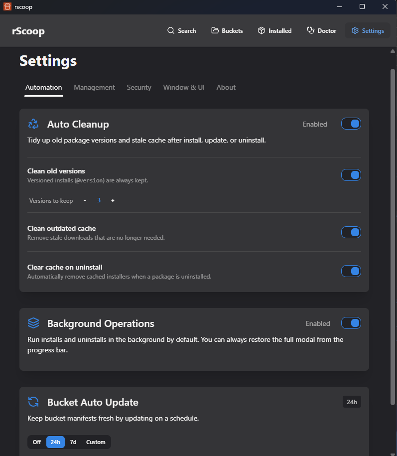

A desktop GUI for [Scoop](https://scoop.sh), search, install, update and manage Windows packages without touching the terminal.

---

## What is rScoop?

rScoop is a native Windows app that wraps the [Scoop](https://scoop.sh) CLI. It doesn't replace Scoop rather it gives you a proper interface for it. Search across all your buckets at once, install and update packages, manage buckets, clean up disk space, and optionally scan downloads through VirusTotal, all from one window.

Built with Rust and SolidJS on [Tauri 2](https://v2.tauri.app). Sits in your system tray when you're not using it.

## Features

**Search**: Type a query, get results from every added bucket instantly. Results show the bucket, version, and whether you already have it installed. Click to view the full manifest or install directly.

**Installed Packages**: Grid view of everything Scoop has installed. Filter by name or bucket, see what has updates available, hold versions, uninstall, or switch to a specific version.

**Buckets**: Browse your current buckets, see last-updated timestamps, or search GitHub for community buckets by stars/forks. Add or remove buckets from the UI.

**System Doctor**: Checks for missing dependencies (Git, 7-Zip), broken shims, and other common issues. One-click cleanup for old package versions and stale download caches. Full cache and shim manager with per-file sizes.

**VirusTotal Integration**: Paste your API key in settings and rScoop will scan packages before install. Configurable threat threshold blocks anything above it.

**Background Operations**: Install, update, and uninstall packages without waiting. Operations queue up and run one at a time behind a progress bar. Start browsing for your next package while the current one installs.

**Settings**: Dark/light theme, tray behavior, auto-cleanup, auto-updates, background operations, security preferences.

## Screenshots

| Installed Packages | System Doctor |
|---|---|
|  |  |

| Bucket Browser | Settings |
|---|---|
|  |  |

## Install

**Prerequisites:** [Scoop](https://scoop.sh) must be installed and working.

1. Go to [Releases](https://github.com/AmarBego/Rscoop/releases) and download the `.msi` installer or portable `.exe`
2. Run it. SmartScreen may prompt you, click *More info* → *Run anyway*
3. On first launch, rScoop caches your bucket metadata. Use the Doctor page to verify your Scoop setup is healthy

rScoop includes built-in auto-updates, you'll be notified when a new version is available.

## Translations

rScoop is available in multiple languages. Translations are community-driven via [Crowdin](https://crowdin.com/project/rscoop), no coding needed, just an eye for good phrasing.

| Language | Status | Contributor |
|---|---|---|
| English | ✅ Complete | [@AmarBego](https://github.com/AmarBego) |
| German | ✅ Complete | [@AmarBego](https://github.com/AmarBego) |
| Simplified Chinese | ✅ Complete | [@Kwensiu](https://github.com/Kwensiu) |
| French | 🔄 Looking for contributors | — |
| Japanese | 🔄 Looking for contributors | — |
| Korean | 🔄 Looking for contributors | — |
| Portuguese | 🔄 Looking for contributors | — |
| Russian | 🔄 Looking for contributors | — |
| Spanish | 🔄 Looking for contributors | — |

Want to help? [Jump in on Crowdin](https://crowdin.com/project/rscoop).
## Tech Stack

| Layer | Tech |
|---|---|
| Backend | Rust, Tauri 2 |
| Frontend | SolidJS, TypeScript, Vite |
| Package ops | Delegates to the Scoop CLI |
| Native | System tray, single instance, auto-updater, file dialogs |

The Rust backend exposes 25+ [commands](src-tauri/src/commands/), search, install, uninstall, update, hold, bucket management, VirusTotal scanning, doctor checks, cache/cleanup, shim management, and more. Everything goes through Scoop's CLI under the hood; rScoop doesn't reimplement package logic.

## Docs

- [User Guide](https://amarbego.github.io/Rscoop/user-guide/): walkthrough of every page
- [Architecture](https://amarbego.github.io/Rscoop/architecture.html): how the Rust commands and SolidJS pages fit together
- [Developer Guide](https://amarbego.github.io/Rscoop/developer-guide.html): local dev setup and contributing

## Contributing

Issues and PRs welcome. See the [Developer Guide](https://amarbego.github.io/Rscoop/developer-guide.html) for setup instructions.

## License

[MIT](LICENSE)