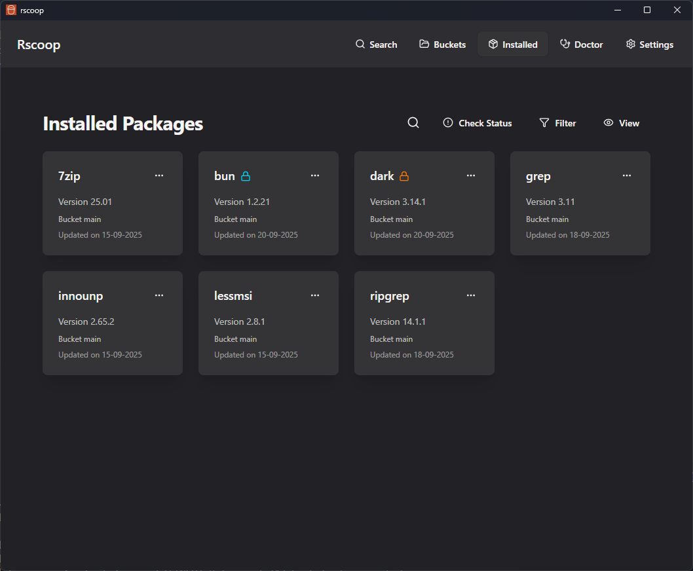

<div align="center">


A desktop app for [Scoop](https://scoop.sh). Search, install, update, and manage Windows packages without dropping into a terminal.

[](https://github.com/AmarBego/Rscoop/releases)
[](LICENSE)
[](https://v2.tauri.app)
[](https://crowdin.com/project/rscoop)

</div>

---


## What is rScoop?

rScoop is a native Windows GUI for the [Scoop](https://scoop.sh) package manager. It does not try to replace Scoop; it gives the CLI a faster, easier interface for everyday work.

Use it to search across buckets, install and update apps, manage installed packages, inspect manifests, clean old versions and caches, and keep an eye on package operations while they run in the background. Optional VirusTotal support can scan downloads before install.

The app is built with Rust, SolidJS, and [Tauri 2](https://v2.tauri.app). It can stay in the system tray, send Windows notifications, and keep long-running installs or updates moving even after the main window is closed.

## Install

Requires [Scoop](https://scoop.sh).

```powershell
scoop bucket add rscoop https://github.com/AmarBego/Rscoop
scoop install rscoop/rscoop
```

Or grab the `.msi` or portable `.exe` from [Releases](https://github.com/AmarBego/Rscoop/releases). Both auto-update from inside the app.

## Features

**Package search**

Search every added bucket at once. Results show the bucket, version, and install state, with quick actions for viewing the manifest or starting an install.

**Installed packages**

Browse installed apps in a grid or list, filter by name or bucket, check which packages have updates, hold versions, uninstall apps, or switch versions.

**Bucket management**

View your current buckets, check when they were last updated, search GitHub for community buckets, and add or remove buckets from the UI.

**System Doctor**

Check for missing dependencies such as Git and 7-Zip, broken shims, stale caches, and other common Scoop problems. Cleanup tools include old-version removal, cache management, and a shim manager with per-file details.

**Background operations**

Install, update, uninstall, cleanup, and scan jobs run through a background operation system. Queue several tasks, minimize the app, and get a Windows notification when each one finishes.

**Tray launcher**

Launch installed Scoop apps from the tray menu. Pin favorites, hide entries you do not use there, and see real icons extracted from each executable.

**Profile export and import**

Export apps, buckets, holds, Scoop config, and rScoop preferences to a portable JSON profile. Import it on another machine to clone buckets, queue app installs, and merge settings. Profiles use a versioned schema and can be checked into a dotfiles repo.

**Settings and security**

Configure theme, startup behavior, tray behavior, auto-cleanup, bucket auto-updates, background jobs, and VirusTotal scanning.

## Screenshots

| Installed Packages | System Doctor |
|---|---|
|  |  |

| Bucket Browser | Settings |
|---|---|
|  |  |

## Translations

rScoop supports multiple languages through [Crowdin](https://crowdin.com/project/rscoop). Contributors translate the app there, and you do not need to write code to help.

| Language | Status | Contributor |
|---|---|---|
| English | ✅ Complete | [@AmarBego](https://github.com/AmarBego) |
| German | ✅ Complete | [@AmarBego](https://github.com/AmarBego) |
| Simplified Chinese | ✅ Complete | [@Kwensiu](https://github.com/Kwensiu) |
| Arabic | 🧪 Partial RTL preview | Contributor needed |
| Persian (Farsi) | ✅ Complete | [@SMAH1](https://github.com/SMAH1) |
| French | 🔄 Looking for contributors | Contributor needed |
| Japanese | 🔄 Looking for contributors | Contributor needed |
| Korean | 🔄 Looking for contributors | Contributor needed |
| Portuguese | 🔄 Looking for contributors | Contributor needed |
| Russian | 🔄 Looking for contributors | Contributor needed |
| Spanish | 🔄 Looking for contributors | Contributor needed |

Want to help? [Join the project on Crowdin](https://crowdin.com/project/rscoop).

## Tech Stack

| Layer | Tech |
|---|---|
| Backend | Rust, Tauri 2 |
| Frontend | SolidJS, TypeScript, Vite |
| Runtime | [Execra](https://crates.io/crates/execra) for long-running jobs, cancellation, progress, and operation status |
| Package operations | Scoop CLI for installs, updates, and uninstalls; Rust-native logic for indexing, cache cleanup, Doctor checks, profiles, shims, scheduling, and app state |
| Native features | System tray, single instance, auto-updater, file dialogs, Windows notifications |

The Rust backend exposes 30+ [commands](src-tauri/src/commands/) for package search, install, uninstall, update, hold, bucket management, VirusTotal scanning, Doctor checks, cache cleanup, shim management, profile export/import, scheduling, and more.

Scoop remains the source of truth for package installs, updates, and uninstalls. rScoop handles the surrounding workflow in Rust so the app can provide faster indexing, safer filesystem handling, richer UI state, cancellation, and clearer progress reporting.

## Docs

- [User Guide](https://amarbego.github.io/Rscoop/user-guide/): walkthrough of every page
- [Architecture](https://amarbego.github.io/Rscoop/architecture.html): how the Rust commands and SolidJS pages fit together
- [Developer Guide](https://amarbego.github.io/Rscoop/developer-guide.html): local dev setup and contributing

## Contributing

Issues and PRs are welcome. See the [Developer Guide](https://amarbego.github.io/Rscoop/developer-guide.html) for local setup instructions.

## License

[MIT](LICENSE)
