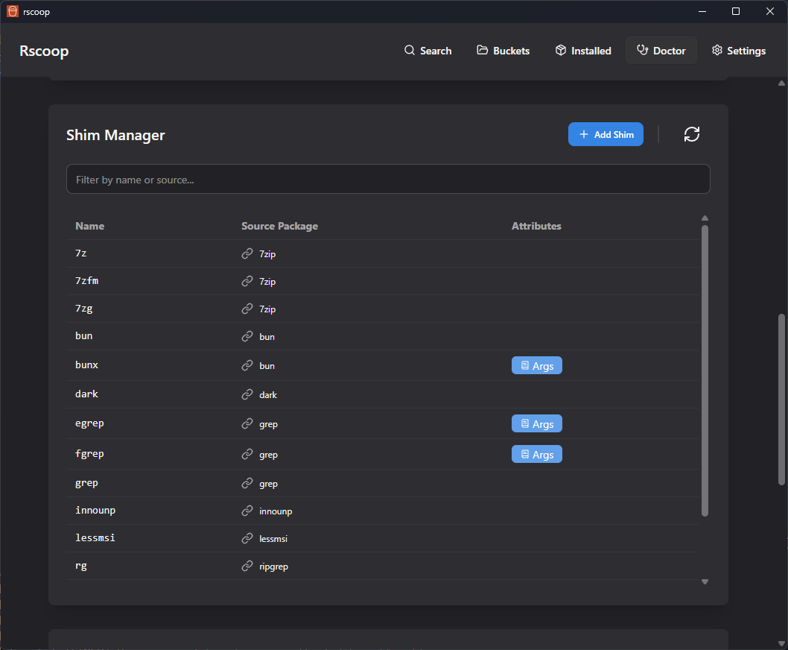

# Rscoop - A Modern, Powerful GUI for Scoop


Welcome to **Rscoop**, (rust-scoop) the ultimate graphical user interface for the [Scoop](https://scoop.sh/) package manager on Windows. Rscoop isn't just a pretty face; it's a powerhouse of functionality designed to be a complete replacement for the command line. Its intuitive, modern UI is incredibly easy to grasp, making package management a breeze for both new and experienced users.

## 🚀 Installation

1.  Go to the [**Releases**](https://github.com/AmarBego/rscoop/releases) page.
2.  Download the latest `.msi` installer file or portable `.exe` file.
3.  Run the installer. That's it!

## ✨ Features

Rscoop is more than just a package list. It's a full-fledged, native management toolkit that supercharges your Scoop experience.

### 🚀 Blazing-Fast Native Performance
At its core, Rscoop leverages a custom-built Rust backend to handle the heavy lifting. We've re-engineered critical logic to be native to Rscoop, delivering incredible speed and responsiveness.
- **Instant Search**: Find the exact package you need in milliseconds. Our native search implementation scans all your buckets instantly.
- **Package & Update Discovery**: Listing installed packages and checking for available updates is faster than ever.

### ⚙️ Advanced System & Package Control
Rscoop provides a level of control that goes far beyond the standard command line. Manage every aspect of your Scoop installation and packages through an intuitive UI.
- **Shim Manager**: A complete interface to manage your Scoop shims. View, remove, and even `alter` shims without touching the command line.
- **Hold Packages**: Prevent specific packages from being updated with a single click, giving you full control over your versions.
- **Cache Manager**: Get a detailed view of all cached installer files, see how much space they're using, and selectively remove them.
- **Package Details**: Instantly view detailed information, notes, and the full package manifest for any application.

### 🛡️ System Health
Keep your Scoop installation in top shape with our integrated System Doctor.
- **Dependency Checkup**: Run diagnostics to find and fix common problems with your Scoop setup, like missing Git/7-Zip, with a single button click.

### ✅ Seamless & Secure Operations
For core actions, Rscoop acts as a seamless wrapper around the battle-tested official Scoop CLI, ensuring maximum compatibility and reliability. All operations are fully integrated into the UI—you'll never see a command prompt.
- **Install, Uninstall, & Update**: Manage packages with the click of a button, backed by Scoop's robust engine.
- **Security-First Installation**: A standout Rscoop feature. Before installing, the application can automatically scan the package with VirusTotal. This pre-install check protects you from malware by blocking the installation if threats are detected, a safety layer not present in standard Scoop.
- **System Cleanup**: Easily clean up old package versions to free up disk space.


## 🖼️ Screenshots

| Search Page | Installed Packages (Grid) | System Doctor | Shims |
| :---: | :---: | :---: | :---: |
|  |  |  |  |

| Package Details | Operation in Progress | Settings |
| :---: | :---: | :---: |
|  |  |  |


## ❤️ Acknowledgements & Tech Stack

Rscoop wouldn't be possible without the incredible work of the open-source community.

-   **[Scoop](https://scoop.sh/)**: For creating the best package manager for Windows.
-   **[sfsu (Stupid Fast Scoop Utils)](https://github.com/winpax/sfsu)**: For the original high-performance scoop logic that Rscoop's native backend is based on.
-   **[Tauri](https://tauri.app/)**: For the lightweight and secure desktop application framework.
-   **[SolidJS](https://www.solidjs.com/)**: For the fast and reactive UI library.
-   **[daisyUI](https://daisyui.com/)**: For the component library for Tailwind CSS.

---

## For Developers

### Prerequisites

- [Node.js](https://nodejs.org/) (v18+)
- [Rust](https://www.rust-lang.org/tools/install) (latest stable)
- [Scoop](https://scoop.sh/) installed on your system

### Development

1. Clone the repository:

```bash
git clone https://github.com/AmarBego/rscoop.git
cd rscoop
```

2. Install dependencies:

```bash
npm install
```

3. Start the development server:

```bash
npm run tauri dev
```

### Building

To build the application for production:

```bash
npm run tauri build
```

This will create an installer in the `src-tauri/target/release/bundle` directory.

### Contributing

Contributions are welcome! Please feel free to submit a Pull Request.

### License

MIT
