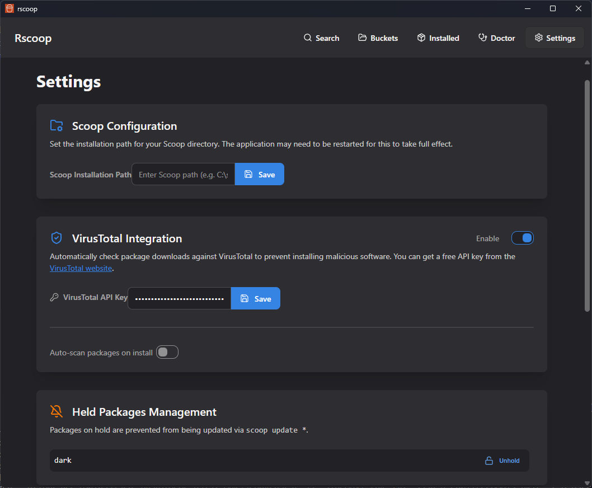

# Rscoop - A Modern, Powerful GUI for Scoop


Welcome to **Rscoop**, a beautiful and feature-rich graphical user interface for the [Scoop](https://scoop.sh/) package manager on Windows. Rscoop is designed to be a complete replacement for the command line, providing a fast, intuitive, and powerful way to manage your software.

Built with a focus on performance and a clean user experience, Rscoop leverages the speed of Rust and the modern reactivity of SolidJS to make managing your Scoop packages a joy.

## ✨ Features

Rscoop is more than just a package list. It's a full-fledged management toolkit.

### 📦 Core Package Management
- **Blazing Fast Search**: Instantly search for packages across all your buckets, powered by `sfsu`.
- **Install & Uninstall**: Easily install new packages and remove old ones with a click.
- **One-Click Updates**: See all available updates and upgrade all your packages at once.
- **Detailed Package Info**: Click on any package to open a modal with detailed information, notes, and metadata.
- **View Manifests**: Inspect the JSON manifest for any package directly within the app.

### 🛡️ System Health & Security
- **VirusTotal Integration**: Automatically scan packages on install to protect you from malware. Rscoop will warn you if any detections are found.
- **System Doctor**: A central hub for maintaining your Scoop installation.
    - **Health Checkup**: Run diagnostics to find and fix common problems with your Scoop setup.
    - **Smart Cleanup**: Free up disk space by cleaning up old, uninstalled package versions and outdated cache files.
- **Hold Packages**: Prevent specific packages from being updated, giving you full control over your versions.

### ⚙️ Advanced Control
- **Cache Manager**: Get a detailed view of all cached installer files, see how much space they're using, and selectively remove them.
- **Shim Manager**: A complete interface to manage your Scoop shims. View, remove, add, and even `alter` shims without touching the command line.
- **Customizable Views**: Switch between a responsive grid view and a detailed list view for your installed packages. Sort and filter with ease.

## 🖼️ Screenshots

*(Placeholder: Add screenshots of the application here)*

| Search Page | Installed Packages (Grid) | System Doctor |
| :---: | :---: | :---: |
|  |  |  |

| Package Details | Operation in Progress | Settings |
| :---: | :---: | :---: |
|  |  |  |


## ⚠️ Early Development Stage

This project is still in its early stages. While it's packed with features, it has not yet been tested for many bugs or edge cases. Please use it with this in mind and feel free to report any issues you find!

## 🚀 Installation

1.  Go to the [**Releases**](https://github.com/AmarBego/rscoop/releases) page.
2.  Download the latest `.msi` installer file.
3.  Run the installer. That's it!

## ❤️ Acknowledgements & Tech Stack

Rscoop wouldn't be possible without the incredible work of the open-source community.

-   **[Scoop](https://scoop.sh/)**: For creating the best package manager for Windows.
-   **[sfsu (Stupid Fast Scoop Utils)](https://github.com/winpax/sfsu)**: For the original high-performance scoop logic that Rscoop's native backend is based on.
-   **[Tauri](https://tauri.app/)**: For the lightweight and secure desktop application framework.
-   **[SolidJS](https://www.solidjs.com/)**: For the fast and reactive UI library.
-   **[daisyUI](https://daisyui.com/)**: For the component library for Tailwind CSS.

---

## For Developers

### Prerequisites

- [Node.js](https://nodejs.org/) (v18+)
- [Rust](https://www.rust-lang.org/tools/install) (latest stable)
- [Scoop](https://scoop.sh/) installed on your system

### Development

1. Clone the repository:

```bash
git clone https://github.com/AmarBego/rscoop.git
cd rscoop
```

2. Install dependencies:

```bash
npm install
```

3. Start the development server:

```bash
npm run tauri dev
```

### Building

To build the application for production:

```bash
npm run tauri build
```

This will create an installer in the `src-tauri/target/release/bundle` directory.

### Contributing

Contributions are welcome! Please feel free to submit a Pull Request.

### License

MIT
