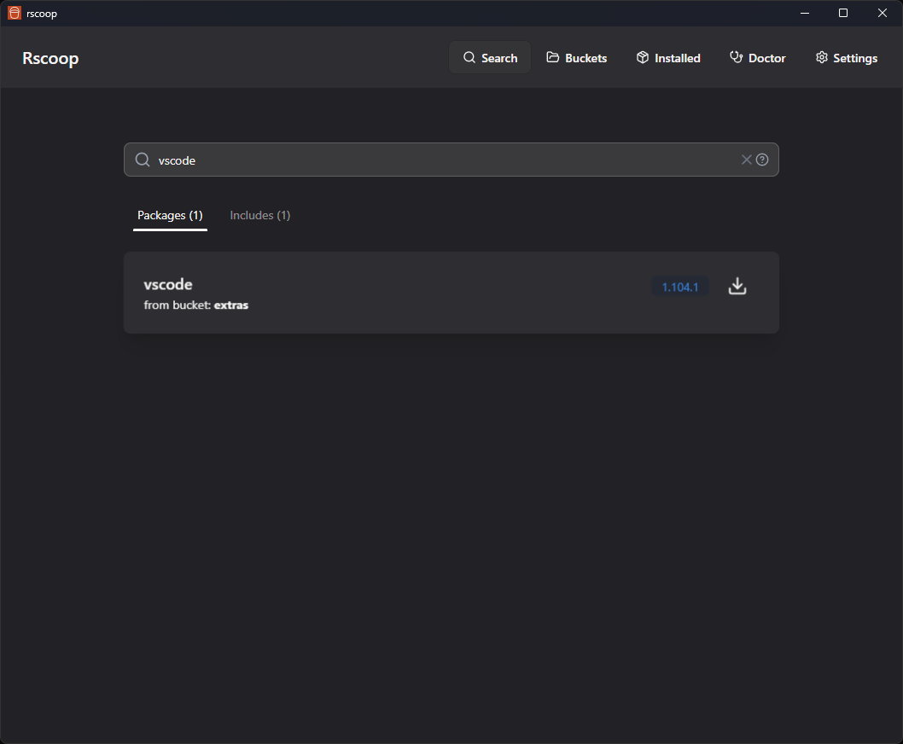
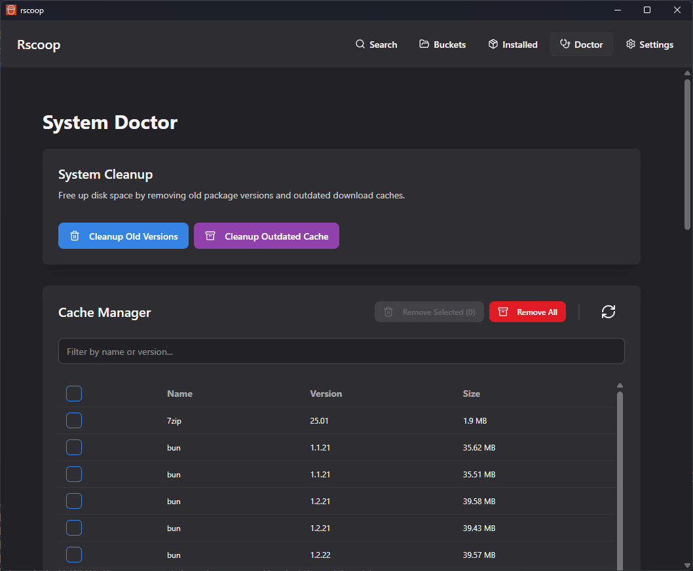
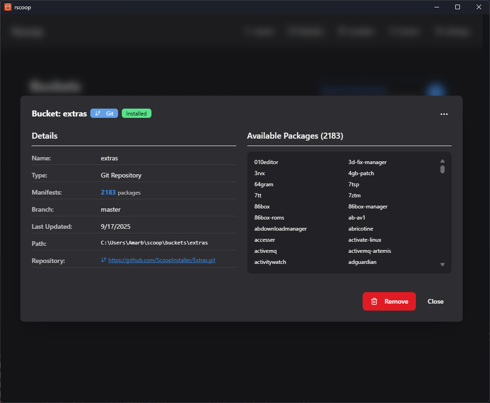

# Rscoop

**Rscoop** is a blazing-fast, modern graphical interface for [Scoop](https://scoop.sh), the Windows package manager. Built with a **Rust** backend and a **SolidJS** frontend, it delivers a native, responsive experience that supercharges your workflow.

[Documentation](https://amarbego.github.io/Rscoop/) | [Download](https://github.com/AmarBego/rscoop/releases)

## ✨ Key Features

### ⚡ Unmatched Performance
*   **Native Rust Backend**: Critical logic is re-engineered in Rust for instant responsiveness.
*   **Instant Search**: Scan all your buckets and find packages in milliseconds.
*   **Smart Caching**: Lightning-fast offline search capabilities.

### 📦 Complete Package Management
*   **Visual Control**: Install, update, and uninstall packages with a single click.
*   **Version Switching**: Seamlessly switch between different versions of installed applications.
*   **Hold Updates**: Prevent specific packages from updating to maintain stability.
*   **Multi-Select Operations**: Bulk install, update, or remove multiple packages at once.

### 🪣 Advanced Bucket Management
*   **Discover & Explore**: Browse thousands of community buckets directly within the app.
*   **Full Control**: Add, remove, and manage both Git and local buckets.
*   **Manifest Viewer**: Instantly inspect package manifests and notes.

### 🛡️ Security & Health
*   **VirusTotal Integration**: Automatically scan packages before installation to block malware.
*   **System Doctor**: One-click diagnostics to find and fix common Scoop issues (missing dependencies, path issues).
*   **Cleanup Tools**: Easily remove old package versions and clear cache to free up disk space.

### 🎨 Modern Experience
*   **Beautiful UI**: A polished, theme-aware interface (Dark/Light modes).
*   **Customizable**: Configure launch pages, window behavior, and automation settings.

## 🖼️ Gallery

| Search | Package Details |
| :---: | :---: |
|  |  |

| Bucket Management | System Doctor |
| :---: | :---: |
|  |  |

| Settings | Bucket Modal |
| :---: | :---: |
|  |  |

## 🚀 Installation

1.  Download the latest `.msi` or portable `.exe` from [**Releases**](https://github.com/AmarBego/rscoop/releases).
2.  Run the installer.
3.  Enjoy a better Scoop experience!

## 🛠️ Tech Stack

*   **Backend**: Rust (Tauri)
*   **Frontend**: SolidJS, TypeScript, TailwindCSS, daisyUI
*   **Core Logic**: Inspired originally by [sfsu](https://github.com/winpax/sfsu)

## 📄 License

MIT
