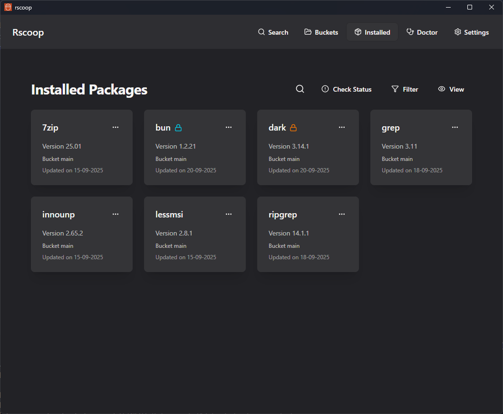

# Rscoop

Rscoop is a native desktop interface for the Scoop package manager. It pairs a Rust backend with a SolidJS frontend to make discovering, installing, and maintaining Windows software fast and reliable without touching the command line.

## Highlights

- Native Rust services keep search, bucket syncing, and package operations quick even on large Scoop installations.
- Rich package metadata: manifests, release notes, shims, cache size, and version history are available in a click.
- Advanced Scoop tooling built in, including System Doctor automation, cache cleanup, shim editing, and bucket health checks.
- Security first design with optional VirusTotal scanning, granular permission prompts, and audit-friendly logging.
- Tray integration that keeps Rscoop running in the background and exposes shortcuts to installed Scoop apps.

## What You Can Do

- Browse entire Scoop ecosystem buckets with instant filtering and an expanded search that works offline once cached.
- Install, update, hold, uninstall, or switch versions of packages with progress tracking and actionable feedback.
- Keep Scoop healthy using dependency diagnostics, automated helpers for Git and 7-Zip, and one-click cleanup tasks.
- Configure Scoop paths, window behavior, update channels, and VirusTotal API keys from a single settings panel.

## System Requirements

- Windows 10 version 2004 or newer.
- Scoop installed and initialized on the machine.
- For development: Node.js 18+, Rust stable toolchain, and the Tauri prerequisites (Visual Studio Build Tools).

Use the [**Getting Started**](getting-started.md) section next for installation instructions, or jump straight to the **User Guide** to explore features.

## Advanced Topics

- [**Architecture**](architecture.md) - Technical overview of Rscoop's design.
- [**Developer Guide**](developer-guide.md) - Set up a development environment.