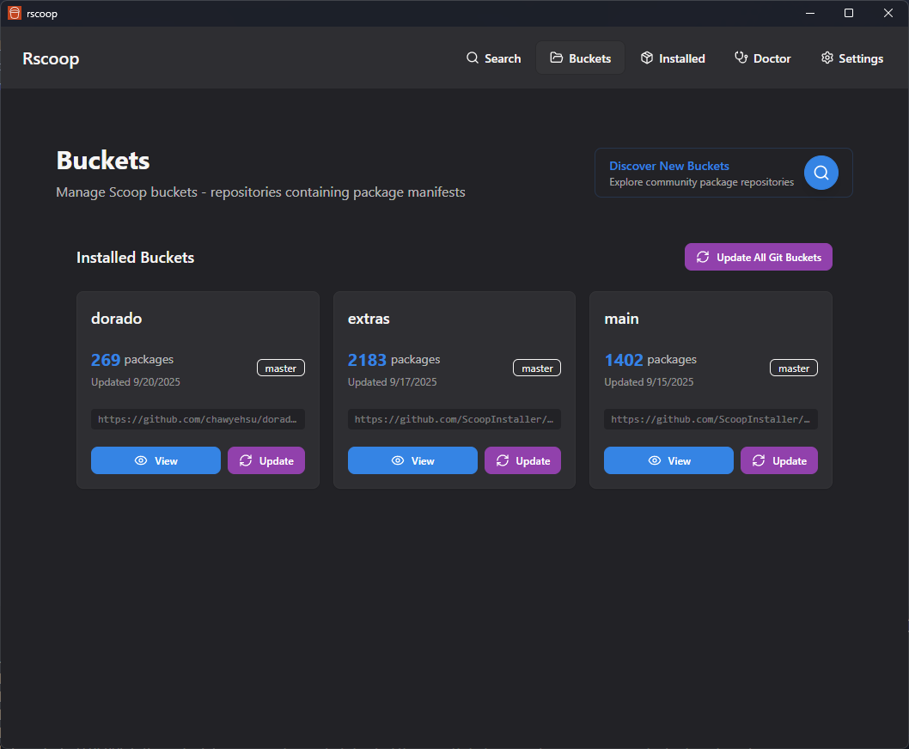

# Buckets

Use the **Buckets** view to manage the repositories that feed Scoop packages into your environment and to discover new sources.

## Installed Buckets

- Every bucket you have added appears in the grid with its manifest count and last updated timestamp.
- Select a bucket to browse its manifests. Rscoop loads the manifest list via native commands so even large buckets stay responsive.
- Click a manifest name to preview the package in the details modal or install it directly.
- Use the **Update** button on a bucket tile to pull the latest commits without leaving the UI.

## Discover New Buckets

Activate the discovery panel to:

- Search GitHub for public Scoop buckets with live filtering based on stars, forks, and language preferences.
- Trigger an **expanded search** that downloads an offline index of thousands of community buckets. You choose the star minimum and whether to include Chinese-hosted repositories before Rscoop fetches the data.
- Inspect buckets you have not installed yet with full descriptions, star counts, and manifest totals.
- Install, validate, or remove buckets using the install wizard backed by the Rust commands in bucket_install.rs.

## Cache Controls

The search panel lets you clear the cached bucket index when you want to refresh remote data. Offline searches remain fast because Rscoop stores the expanded list locally and keeps it in sync when you install new buckets.

## Related Pages

- [Search](../search.md) - Search for packages within installed buckets.
- [Settings](../settings.md) - Configure bucket-related preferences.