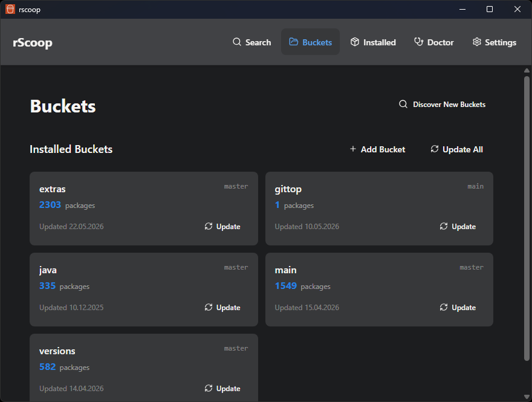

# Buckets

Manage your Scoop buckets and find new ones.

## Your buckets

Every bucket you've added shows up in a grid with its manifest count and last-updated timestamp. From here you can:

- Browse a bucket's manifests and preview or install packages from the details modal
- Update a bucket to pull the latest commits
- Remove buckets you don't need

## Discovering new buckets

The discovery panel lets you search for public Scoop buckets on GitHub. You can filter by stars, forks, and language.

For a wider search, use **Expanded Search** — this downloads an offline index of thousands of community buckets. You pick a minimum star count and whether to include Chinese-hosted repos before Rscoop fetches the data.

Once downloaded, the expanded search works offline. You can clear the cached index from the panel when you want fresh data.

## Adding buckets

Found one you like? The install wizard validates the bucket URL and adds it via the Rust backend. Rscoop handles Git clone, validation, and error reporting.
