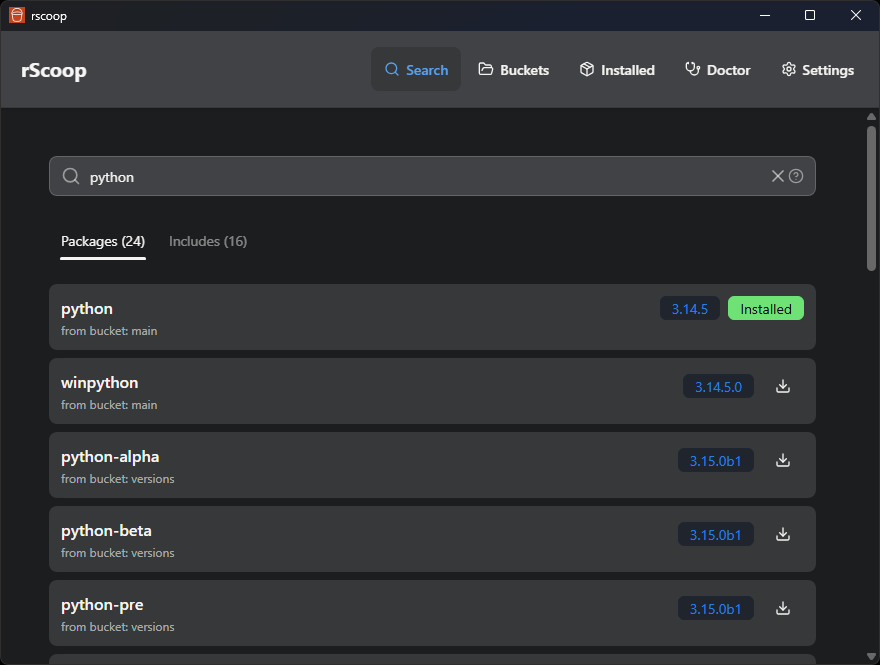

# Search

Type a query and get results from every bucket you have added.

## How it works

The search bar queries a local manifest cache built by the Rust backend. Results come back instantly, no network call needed for installed buckets.

Results show the package name, bucket, version, and whether it's already installed. You can switch between two tabs:

- **Packages**, the main apps
- **Includes**, binaries and executables shipped inside packages

## Installing from search

Click any result to open the package details modal. From there you can:

- Read the full Scoop manifest (description, homepage, notes, architecture)
- Edit the manifest in rScoop or open it in your text editor or IDE
- View shim details and cache usage
- Hit **Install** to kick off the install with live progress output

If VirusTotal scanning is enabled, the scan result shows up before the install starts.

## Tips

- Click the help icon next to the search bar for advanced search syntax (quotes for exact matches, etc.).
- Open the Manifest tab to read or edit the JSON. See [Manifest Editing](manifests.md) for backups and what happens when the bucket updates.
