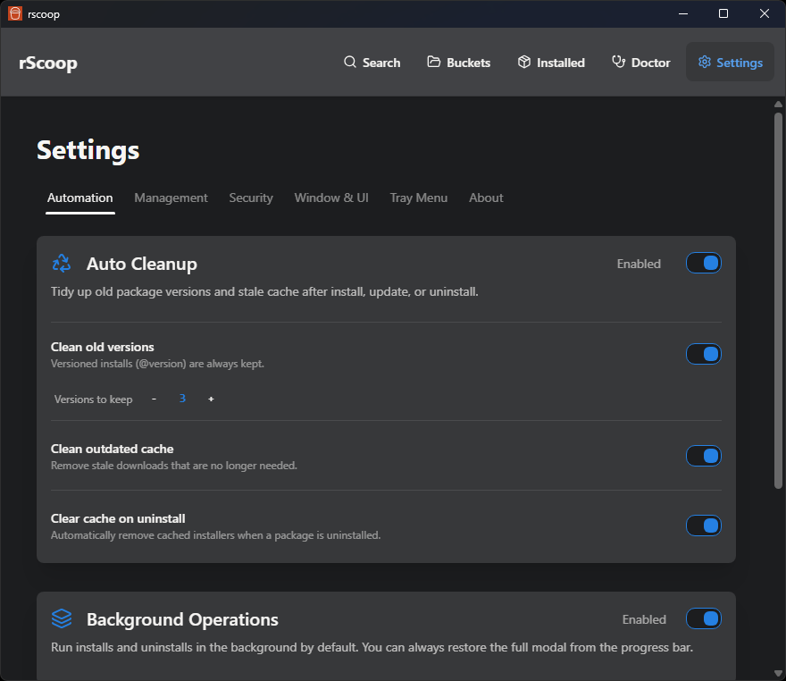

# Settings

Settings are split into six tabs: Automation, Management, Security, Window, Tray, and About.

## Automation

### Auto Cleanup
- Toggle automatic cleanup after bulk operations
- Set how many previous versions of each package to keep
- Toggle removal of outdated caches
- Clear cache on uninstall: automatically removes cached installers when a package is uninstalled

### Background Operations
- Toggle to run all installs/updates/uninstalls in the background by default (enabled for new installs)
- Operations show progress in a bar at the bottom of the screen
- VT scans still open the modal since they need your input

### Bucket Auto Updater
- Pick an update interval: off, 1h, 6h, 24h, 7d, or a custom interval in seconds
- Optionally auto-update packages after bucket updates finish
- The scheduler persists across restarts. If enough time passed while rScoop was closed, it runs immediately on launch
- Debug mode (see Window tab) unlocks rapid test intervals like 10 seconds

## Management

### Scoop Configuration
- Shows the detected Scoop root path
- Override it if you use a non-standard install location

### Held Packages
- Lists packages you've locked to a specific version
- Remove holds directly from here

### Export & Import
- Export your entire rScoop + Scoop setup to a portable JSON file
- Import on a new machine to rebuild the same setup
- Profile groups include Full profile (everything), Scoop-compatible (apps + buckets only), Just preferences, and Custom
- Import does not uninstall anything. It queues apps for background install, clones buckets, and merges settings
- Profiles are plain JSON with a versioned schema, so they can live in a dotfiles repo

## Security

### VirusTotal Integration
- Enter your VirusTotal API key to enable pre-install scanning
- Toggle auto-scan: when enabled, rScoop scans first and only proceeds if clean
- Set a threat tolerance (max detection count). Anything above gets blocked

## Window

### Theme
- Switch between light and dark themes (uses daisyUI themes under the hood)

### Language
- Pick your UI language. Translations are managed through Crowdin
- English, German, and Simplified Chinese are complete; other languages need contributors

### Window Behavior
- Toggle close-to-tray vs. actually exiting when you close the window

### Startup
- Enable or disable starting rScoop automatically on Windows boot

### Default Launch Page
- Pick which page rScoop opens to (Search, Installed, Buckets, Doctor, or Settings)

### Debug Mode
- Shows a debug button with cache state and system info
- Unlocks rapid test intervals for the auto-update scheduler

## Tray

### Tray Menu
- Pin your favorite Scoop apps to the top of the tray menu
- Hide apps you never launch from the tray
- Edit the tray label, icon visibility, and app ordering
- The tray uses executable icons from each app so entries are easier to recognize

## About

- Current rScoop version and links to GitHub
- Manual update check (skipped if you installed via Scoop)
- Release notes for available updates
- Log viewer for inspecting recent operations
